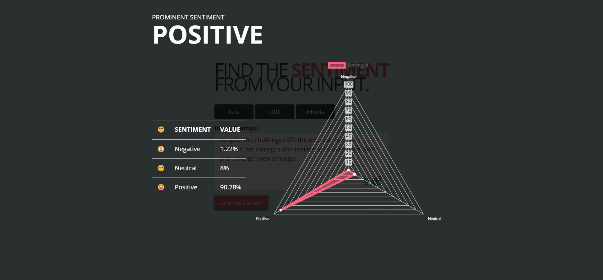
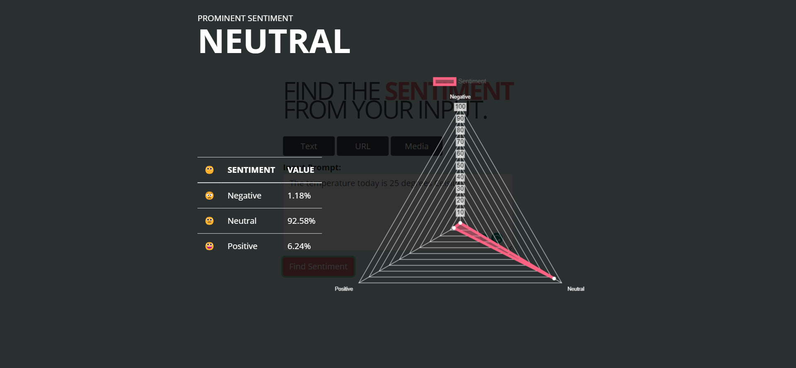
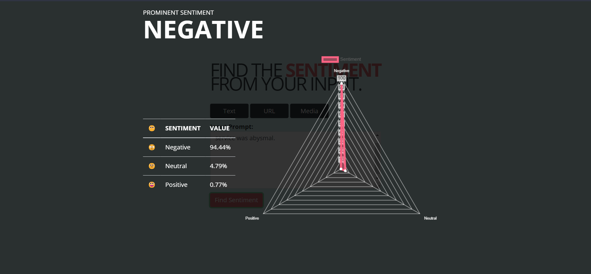
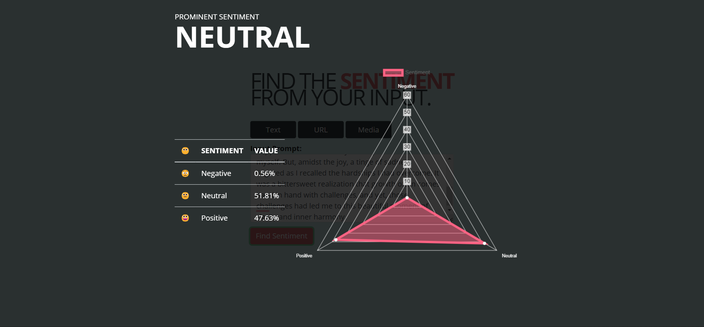
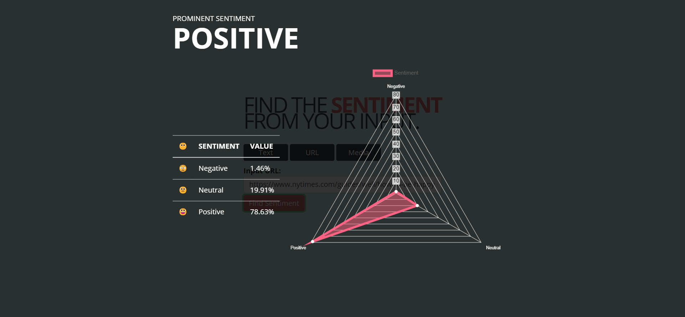

# Sentiment Analysis Using Flask

This is a sentiment analysis project created using Flask.

This application has been created to simulate the understanding of sentiment across various media such as text, URL.


## Installation

1. **Clone the code from this repository:**

   ```
  https://github.com/Celestin25/sentiment_system/
   ```

2. **Create a virtual environment using the `virtualenv` command.**

   Virtual environments are created so that the libraries that are installed and used for this project won't impact any other libraries installed for other projects. This creates an encapsulation for the project so that anything installed for this project can only be used for this project.

   Do the following in the terminal.

   **Installing virtualenv (this can be done globally)**

   ```py
   pip install virtualenv
   ```

   **Creating a virtual environment**

   ```py
   virtualenv project-name-env
   ```

   where `project-name-env` can be any name that you want to give. Example: `virtualenv sentiment-analysis-env`

   <small>Having **-env** at the end is not mandatory, it gives an indication that helps us understand that this is a virtual environment directory.</small>

   **Activate the virtual environment to start using it.**

   ```
   project-name-env/Scripts/activate
   ```

3. **Install the necessary libraries for the project.**

   Use the **requirements.txt** file to install all the dependencies/libraries used in this project.

   Since we're installing this in a virtual environment, all the libraries will be installed within this environment.

   To install packages from a **requirements.txt** file, you would use:

   ```py
   pip install -r requirements.txt
   ```

   This will install all of the packages listed in the requirements.txt file.

4. **Install additional transformers libraries, as required**

   If you get an error based on the transformers library from huggingface, just update the rest [PyTorch, TensorFlow, Flax] from their installation page: https://huggingface.co/docs/transformers/installation

   ```py
   pip install transformers[torch]
   ```

   ```py
   pip install transformers[tf-cpu]
   ```

   ```py
   pip install transformers[flax]
   ```

5. **Change the .env directory variables.**

   Create a .env file and input the necessary directory locations for your cache to be saved. Please note, that this is a big file and would need space necessary for input.

   Inside, the .env file, update the variable directory location. An example is posted in .env.example file.

   ```
   HUGGINGFACE_CACHE_DIR = ["your-hugging-face-cache-directory"]
   TORCH_CACHE_DIR = ["your-torch-cache-directory"]
   ```

6. **Running the project**

   A Flask project can be run using the following command:

   ```
   python app.py
   ```

   This will start the Flask development server. You should see output similar to this:

   `* Running on http://127.0.0.1:5000/ (Press CTRL+C to quit)`

   This means your Flask app is running on your local machine (localhost) on port 5000. You can access it by opening a web browser and navigating to http://127.0.0.1:5000.

   If you see another port, use that as http://127.0.0.1:port where the port is the port number.

## Testing

The web application currently shows the sentiment of text and URL.

_(**Note:** Media is a future implementation. I have the idea of transcribing audio and videos to get the text and finding the sentiment via that. But images would be different as it needs object identification to notice if it's a facial, object or other representation. I also wanted to use libraries like DeepFace and then implement an average for videos so that the visual and auditory elements are taken into consideration for the sentiment analysis. I'm still learning. :D Woohoo!)_

Once the application starts running, you get this screen in the home page. By default, the page routes to Text sentiment analysis.


You can change the input type by clicking on the relevant button as required.

**For URL Sentiment Analysis:**


**For Media Sentiment Analysis:** (Work in-progress)


Once you have selected the relevant method of analysis, input the content which can be text in the textarea input box or any url in the text input box. (**Note:** Currently URL analysis is done on the textual content present in that webpage. Mainly for article analysis.)

Please note, that since the RoBERTa model from transformers have a max length of 510 characters, I've chunking the sections and analyzing the content and finding the average sentiment. This can probably show incorrect or skewed result since the context dependency of all chunks is analyzed separate.

The analysis is done and the result is shown as an overlay with the `prominent sentiment`, `negative, neutral and positive sentiment values` and `a radar chart with the sentiment values`.

### Testing for Text Sentiment Analysis

In the textarea, specify the text that you want to analyze and click on the "Find Sentiment" button.

**Example for a Positive sentence:** "Despite the challenges life throws your way, you possess the strength and resilience to overcome them and emerge even stronger."



**Example for a Neutral sentence:** "The temperature today is 25 degrees Celsius."



**Example for a Negative sentence:** "The food at that restaurant was terrible and the service was abysmal."



**Example for a random paragraph generated by ChatGPT:** "As the sun dipped below the horizon, casting a golden glow across the evening sky, I found myself standing at the edge of a tranquil lake. The gentle breeze rustled the leaves on the trees, and the sound of birds chirping added a serene melody to the moment. Reflecting on my journey of self-discovery, I couldn't help but feel a sense of contentment and happiness that I had finally found peace within myself. But, amidst the joy, a tinge of sadness lingered as I recalled the hardships I had overcome. It was a bittersweet realization that growth often comes hand in hand with challenges, and yet, those challenges had led me to this beautiful moment of clarity and inner harmony."



### Testing for URL Sentiment Analysis

In the case of URL Sentiment Analysis, just copy-paste the URL that you want to analyze. Do note, that this is a sentiment analysis done for the text content on that webpage.

**Example for URL:**: "https://www.nytimes.com/guides/well/how-to-be-happy"




## License

This project is open-sourced under the MIT License.
